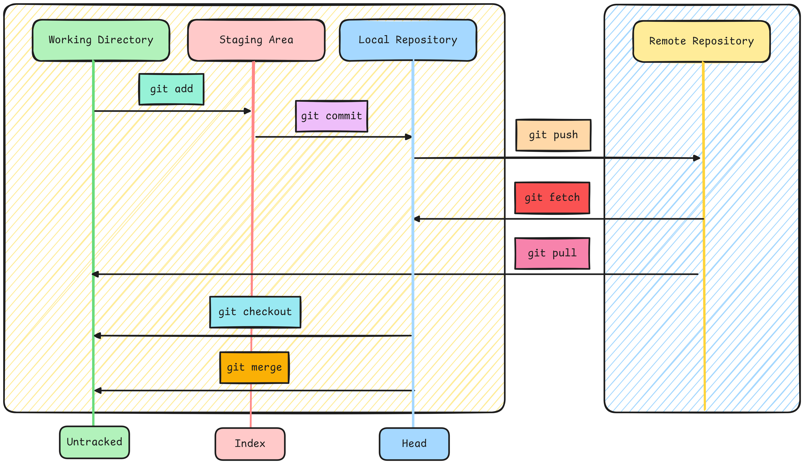
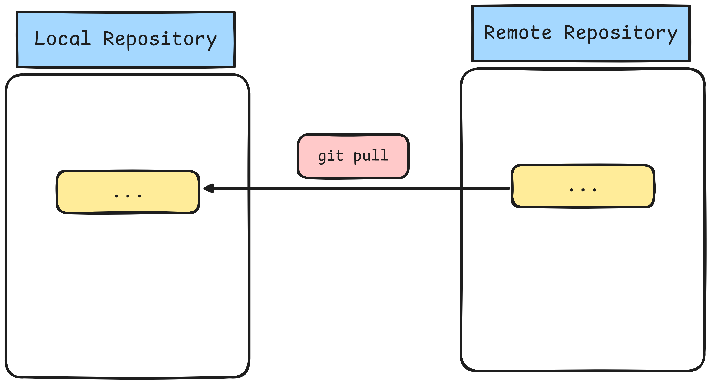

# Introduction to Git

    

## What is Git?
Git is a **distributed version control system** designed to **track changes** in **source code** during software development. It allows multiple **developers to collaborate on a project** keeping a history of changes, facilitating collaboration & ensuring that every modification can be **traced**, **merged** or **reverted** as needed.

## Key Features of Git
- **Content Tracker :** Git **captures snapshots of the entire project directory** & its **contents**. Instead of saving just file changes. Git stores the state of the whole project at the time of each commit efficiently managing versions & history across the project.

    

- **Distributed :** Every developer has a complete **copy of the entire repository** including its history on their own machine.

    

- **Version Control :**  Git tracks changes to files over time allowing us to **go back in time to view**, **manage** & **review the history** of a project. This makes it easy to **restore previous versions** & keep a detailed log of modifications.

    

- **Branching and Merging :** Git **allows developers** to work on **different features** or fixes in parallel through **branches** which can later be **merged** into the main codebase.

    

## Git Repository Types
Git supports two main types of repositories.
1. **Local Repository**
2. **Remote Repository**

    

### 1. Local Repository 
This is a repository stored on our **local machine** where **we can work independently**. Each developer has a complete copy of the project including the **entire version history**. Changes are made **locally** & **can be committed to the local repository** without needing to connect to any **remote server**. In a Local Repository, Git manages changes through **three main areas** :
1. **Working Area**
This is the directory **where we actively make changes to files**. Any **edits**, **additions** or **deletions** happen here but they are **not yet tracked** by **Git** until **we stage them**.
2. **Staging Area (also known as the Index)**
The staging area is a **holding space** between the **working area & the repository**. When we decide to track certain changes **we add them to the staging area** with **`git add`**. It **holds a snapshot** of what will be included in the next commit.
3. **Commit**
Once changes are staged, we can create a commit using **`git commit`** which **saves the staged changes** to the local repository. Each **commit is a snapshot of the project's state at that point in time** allowing us to **go back in time** if needed.

These three areas form the basic workflow in Git ensuring changes are carefully managed before being permanently recorded in the repository.
### 2. Remote Repository
A **remote repository is hosted on a server** & is typically used to **share code among team members** or **backup the project**. Multiple developers can collaborate by pushing their changes to and pulling updates from the remote repository. 

#### Features of Remote Repository :
- **Collaboration :** It enables teams to collaborate on code & track changes.
- **Backup :** It acts as a backup of your project stored in a remote location.
- **Synchronization :** Changes made locally can be pushed to the remote repository & updates from others can be pulled to keep the codebase in sync.

Common platforms for remote repositories include :
- **GitHub :** Popular for **Open-Source Projects**.
- **GitLab :** Known for **DevOps features** & **CI/CD integration**.
- **Bitbucket :** Often used for **Private & Business** projects.
## Understanding the Areas in Git

    

### Working Area
#### Definition
The working area is the local directory where you create and modify files for your project. This area contains all the files and folders that you are currently working on.
#### Characteristics
- **Untracked Changes :** Any new files or changes made to existing files are considered untracked by Git until you explicitly stage them.
- **Local Modifications :** You can freely edit files in this area without affecting the repository history. This is where you do all your development work.
- **Visibility :** Files in the working area can be seen and modified using any text editor or Integrated Development Environment (IDE).
### Staging Area
#### Definition 
The staging area (also known as the index) is an intermediate space where changes are prepared before being committed to the repository. It acts as a buffer between the working area and the committed state.
#### Characteristics
- **Marked for Inclusion :** When you add files to the staging area using the git add command, you mark them for inclusion in the next commit. This allows you to select which changes you want to commit.
- **Snapshot of Changes :** The staging area holds a snapshot of the changes you have staged. This snapshot will be saved in the next commit allowing you to control what gets committed.
- **Selective Committing :** You can stage individual files or specific changes within files, giving you fine-grained control over your commit history.
### Committed Files
#### Definition
Committed files are those that have been saved to the Git repository. A commit is a snapshot of the project at a specific point in time.
#### Characteristics
- **Tracked Changes :** Once files are committed git tracks their changes allowing you to revisit the commit history at any time.
- **Commit History :** Each commit is associated with a unique identifier (hash) and contains metadata, including the author, date & commit message. This history allows you to understand the evolution of your project.
- **Revisions :** Committed files can be reverted, modified or compared with other commits using various Git commands. This feature is crucial for collaboration & maintaining the integrity of the project over time.
## Git Add
### What is git add?
**Git add** is a command **used to stage changes in Git** preparing them to be included in the **next commit**. It doesn’t actually commit the changes it simply **moves modified or new files from the working area to the staging area** (also known as the "index"). This step is crucial in Git’s workflow because only staged changes can be committed.

    

### Key Concepts of `git add`
1. Staging Changes
2. Staging
3. Tracking New Files
4. Removing Changes from Staging
## Git Commit
### What is Commit?
**Git commit** represents a **snapshot of the project at a specific point in time**. It stores changes made to the files in a repository and forms the backbone of Git's version control.

    

A commit includes:
- **Author information (name and email)**
- **Commit message (a brief description of the changes)**
- **Changes (diff) (what was added, modified or deleted)**
### Commit Message Guidelines
- **Be clear :** The message should describe the changes and why they were made.
- **Use imperative mood :** Commit messages should describe what the commit does when applied, such as:
    - **`"Fix typo in README"`**
    - **`"Add new authentication method"`**
#### Here are more concise descriptions for different types of Git commits:
- **Added Image :** Included a new image or diagram.
- **Fixed Typo :** Corrected a spelling mistake.
- **Fixed Syntax :** Corrected errors in code or formatting.
- **Added Bold Text :** Highlighted important keywords.
- **Fixed Heading :** Edited or restructured a heading.
- **Updated Image :** Replaced an outdated diagram with a new one.
- **Refined Content :** Improved the clarity or readability of text.
- **Fixed Comments :** Improved explanations in code comments.
## Git Branches
Git **branches** are an essential feature of version control that **allow us to work on different versions of a project simultaneously**. Branches enable **isolated development** meaning we can work on **new features**, **bug fixes** or **experiments** without **affecting the main codebase**. 

    

Here’s how Git branches work:
### 1. Main Branch (Master/Main)
- The main branch is typically where the stable version of the code resides. It’s the default branch when a repository is initialized & it’s often called main (formerly master).
- It holds production-ready code & all features or changes eventually get merged back into this branch.
### 2. Feature Branches
- A feature branch is a separate branch created from the main branch where we can develop new features or make changes.
- This branch keeps changes isolated until they are complete and ready to be merged into the main codebase.
### 3. Branch Creation
We can create a branch at any point. A branch is simply a pointer to a specific commit in the project’s history. Once a branch is created any commits made on that branch will not affect other branches.
### 4. Switching Branches
- Switching between branches allows us to move back and forth between different lines of development. This makes it easy to pause work on one feature and work on another or go back to a previous version of the project.
### 5. Merging Branches
- When a branch is ready to be integrated with the main code we merge it back into the main branch. This can be a fast-forward merge or a more complex three-way merge if the two branches have diverged.
### 6. Conflicts
- If changes from different branches overlap Git may encounter conflicts during a merge. Conflicts need to be manually resolved before the merge can complete.
### 7. Branch Management Best Practices
- **Use Meaningful Names :** Name branches based on the feature or task, making it easy to understand the purpose of each branch.
- **Merge frequently :** To avoid large, complicated merges, it’s a good idea to merge branches back into the main branch regularly.
- **Delete branches :** After a branch has been merged, it’s often deleted to keep the repository clean.

Let's dive into branch merging and management in a **team environment**.
#### 1. Merging Branches
Merging in Git combines the changes from one branch into another, often to incorporate new features or fixes into the **`main branch`**. There are two common types of merges:
- **Fast-Forward Merge :** If there are no new commits on the **`main branch`**, Git can move the branch pointer forward without creating a new commit this is called a **Fast-Forward Merge**. It happens automatically if the branches haven’t diverged.
- **Three-Way Merge :** Happens when both the main and feature branches have new commits. Git creates a new commit to combine changes from both branches.
#### 2. How to Merge
1. **Switch to the Main Branch** (where the changes need to go).
2. **Merge the Feature Branch into the Main Branch**.
3. **Resolve Conflicts if any occur** (e.g., both branches changed the same line of code).
#### 3. Merge Conflicts
1. When two branches change the same part of a file, Git cannot automatically merge and shows a conflict.
2. We edit the file to choose which changes to keep.
3. After resolving, commit the merge to finalize it.
#### 4. Working in Teams
- **Use Feature Branches :** Each developer works on their own branch for a task or feature. Once done they merge their branch into the **`main branch`**.
- **Merge Frequently :** To avoid conflicts keep merging changes from the main branch into your **`feature branch`** regularly.
- **Pull Requests (PRs) :** Before merging into the **`main branch`** the team can review the changes in a pull request to ensure everything looks good.
#### 5. Best Practices
- **Keep Branches Short :** Don't work on a **`feature branch`** for too long before merging it. Smaller, more frequent merges are easier to manage.
- **Review code before Merging :** Use pull requests to get feedback from the team before adding changes to the main branch.
- **Handle Conflicts Early :** Resolve conflicts as soon as they come up so they don’t pile up.

## Git Push
In Git, Push is used to **upload local repository content** to a **remote repository**. Essentially, it **transfers committed changes** from your local repository to the remote making them available to others working on the project.

    

### Key Aspects of `git push`
- **Transfer Changes :** It moves your local commits (newly added or modified files) to a specified branch on the remote repository.
- **Tracking Branches :** When you push, Git typically updates a "**tracking branch**", which represents the **state of the corresponding branch** in the remote repository. The **branch name in the remote** can be the same as the **local one** (commonly master or main) or different depending on how we configure it.
### Common Scenarios
- **Collaborating on Projects :** When working with a team you often push your changes to a shared repository so others can pull them & contribute.
- **Feature Branches :** For larger projects developers often push specific features or fixes to separate branches.
- **Continuous Integration (CI) :** Many projects trigger automatic builds or tests whenever code is pushed to specific branches.
### Important Considerations
- **Push vs. Pull :** **`git push`** uploads changes while **`git pull`** **fetches** & **merges** **changes from the remote repository** to your **local machine**.
- **Permissions :** You need proper permissions (write access) to push to a remote repository especially when collaborating on shared repositories.

## Git Cloning 
Git cloning is the process of creating a **local copy** of a **remote repository** using the **`git clone`** command. This allows us to **download the full version history** & **all branches of a project** from a **remote repository** to our **local machine**. Once cloned, we can make changes, commit & push updates back to the remote repository.
### Key Aspects of `git clone`
- **Repository Copy :** Cloning pulls the entire repository including all commits, branches, tags & files. It’s a one-time operation to create the local copy.
- **Linking to Remote :** When we clone a repository, Git automatically sets up a link to the remote repository (usually named origin). This allows us to pull updates and push changes in the future.
### Common Scenarios
- **Starting a Project :** Developers clone repositories to get a full copy of a project's history and files to begin working.
- **Open-Source Contributions :** In open-source projects, we typically clone the project, create changes locally, and then push to a forked version or submit pull requests.
### Important Considerations
**Forking vs Cloning :** If we want to contribute to a project we don’t own (especially in open-source), it’s **common to fork the repository** (create our own copy in GitHub) & then **clone that fork** to our **local machine**.

## Git Pull Request
A **Git pull request** (often called a **pull request** or **PR**) is a feature used primarily in platforms like **GitHub**, **GitLab** & **Bitbucket** to facilitate code collaboration. A **pull request** allows a **contributor to propose changes they've made to a repository** & then **ask the repository maintainer** to **review** & **merge** **those changes** into the **main codebase**.

### Key Aspects of a `Pull Request`
- **Proposing Changes :** A pull request is created after **you make changes to a branch** in a repository. You can use a **pull request** to let others know about the updates you want to merge.
- **Branch-Based :** Pull requests are made between branches. For example, if you have a feature branch with new functionality you can create a pull request to merge it into the main or master branch.
- **Code Review :** Maintainers or collaborators review the changes, comment, suggest improvements or approve the PR. If everything looks good they merge the changes into the main branch.
- **Collaboration :** Pull requests are used to collaborate on projects discuss the impact of changes & ensure that only quality code is merged into the main codebase.

### Important Considerations
- **Pull Request vs. Push :** A pull request is not the same as pushing changes. A **push sends changes to a remote branch**, while a pull request initiates a **review** & **discussion** for merging those changes into the main codebase.
- **Merge Conflicts :** Sometimes there can be conflicts between the changes in the pull request and the main branch. These conflicts need to be resolved before the PR can be merged.

### Example Workflow
- Fork and clone the original repository.
- Create a new branch for your changes.
- Make and commit changes.
- Push the branch to the remote repository.
- Open a pull request, describe your changes & wait for review.

## Git Fetch
**Fetching** is the process of **downloading changes from a remote repository** without **merging them into your local branch**. This allows you to **see what updates are available on the remote** without **affecting your local repository**.
- **What it does? :** Downloads changes (commits, branches, tags) from the remote repository but does not modify your working files or the current branch.
- **When to use? :** Use **`git fetch`** when you want to **see the changes made in the remote repository** & decide later if you want to merge them into your local branch.
### Example Workflow
You’re working on your local branch and want to check if there are updates on the remote repository.
- Run git fetch to download the latest updates from the remote.
- Git stores these changes in a separate tracking branch (e.g., origin/main).
- You can inspect the changes and decide whether to merge them into your branch.

## Git Pull
Pulling is essentially a combination of two operations: **fetching** and **merging**. When you use **`git pull`** Git **first fetches changes** from the **remote repository** & then **automatically merges them** into your current branch. This operation **modifies your working directory** if there are differences between your local branch and the remote branch.

    

- **What it does?:** Downloads changes from the remote repository and merges them into your current branch.
- **When to use? :** Use git pull when you’re ready to incorporate changes from the remote branch into your local branch.
### Example Workflow
- You’re working on the main branch & there are updates on the remote main branch.
- Run **`git pull`** to **fetch** and **merge** the remote changes into your local branch.
- If there are no conflicts the remote changes are automatically incorporated into your current branch. If there are conflicts you will need to resolve them manually.

## Git Merge Conflict
A **merge conflict** occurs in Git when **two branches have made changes to the same line** of a file or when **one branch edits a file** while **another branch deletes it**. Git is unable to automatically resolve these differences during a merge, requiring manual intervention to resolve the conflict.
### Common Causes of Merge Conflicts:
- **Concurrent Edits :** Two branches modify the same line in a file differently.
- **File Deletion :** One branch deletes a file while another branch modifies it.
- **Changes to Overlapping Lines :** Changes made to adjacent lines that affect the same part of a file.
### Steps to Resolve Merge Conflicts
1. **Step 1.** : Identify the Conflict
2. **Step 2.** : Open the Conflicted Files
3. **Step 3.** : Manually Resolve the Conflict. Edit the conflicted files to resolve the differences. You can keep one of the changes, combine them or create a new resolution altogether. Remove the conflict markers (***`<<<<<<<, =======, >>>>>>>`**) after making your changes.

## Git Fork
In Git and platforms like GitHub a **fork is a personal copy of someone else's repository**. It allows users to **freely experiment with changes** **without affecting the original project**. **Forking** is commonly used in **collaborative development** especially in **open-source projects** to propose changes or contribute to a project.
### Key Features of a Fork
- **Independent Repository :** A fork creates a separate copy of the repository under your account. You can make changes, commit them & push them without affecting the original repository.
- **Pull Requests :** After making changes in a fork you can submit a pull request to the original repository, proposing that your changes be merged into the original project. This is a common way to contribute to open-source projects.
- **Contributions :** Forking is essential for collaboration. It allows multiple users to work on a project simultaneously each making changes in their own fork.
### Best Practice of Forking
1. Fork Responsibly
2. Clone Your Fork Locally
3. Create a New Branch for Changes
4. Keep Your Fork Up to Date
5. Submit a Pull Request When Ready

## Git Rebase
Git Rebase is a Git command that **changes the base of our feature branch** to the **latest commit** on the main branch & then re-applies the **commits from the feature branch on top of the new base**. This results in a **linear history** as it effectively **moves the feature branch to start from the latest commit of the main branch**, replaying all the feature branch's changes as if they were committed after the latest changes on the target branch.

    

### Common Use Cases:
1. **Linear History :** If we want to maintain a clean and linear project history without multiple merge commits rebasing is the better option.
2. **Feature Branch :** When working on a feature branch and the main branch has moved ahead, rebasing your feature branch onto the updated main branch allows for a clean incorporation of changes without merge conflicts.
### Rebase vs Merge:
- **Merge :** Combines two branches preserving the commit history of both. Creates a new commit called a **merge commit**.This new commit merges the changes from two branches and preserves the history of both branches.
- **Rebase :** Moves the entire branch to start from the tip of the main branch replaying all your changes as new commits on top of the other branch. Does not create a merge commit.The history becomes linear without any merge commits
## Git Squash
**Git Squash** refers to **combining multiple commits** into a **single commit**. This is often used to **clean up a branch’s commit history** before merging or rebasing, especially when many small commits can be consolidated into one meaningful commit.

    

### When to Use Squash?
- **Cleanup history :** If you've made many small or unnecessary commits squashing them makes your history cleaner and more readable.
- **Before merging :** Squashing can be useful to present a feature or bugfix as a single concise commit when merging to main.
## Git Cherry Pick
Cherry Pick allow us to apply a **specific commit** (or multiple commits) from **one branch to another**. Instead of **merging an entire branch** **`git cherry-pick`** lets us select **individual commits** & **apply them elsewhere** giving us more control over which changes are brought into the **`main branch`**.

    

### Key Concepts of Git Cherry-Pick
- **Selective Commit Transfer :** We can pick specific commits from one branch and apply them to another without merging the entire branch.
- **Maintains History :** The commit's changes and metadata are preserved but it creates a new commit with a different hash on the target branch.
## Git Reset
Git resetting is a way to undo changes in your repository. It allows us to move the current branch pointer to a specific commit, effectively altering the commit history or the state of our working directory.
### Types of Git Reset
Here are the main types of Git reset & how they work.
#### 1. Soft Reset (`--soft`)
- Moves to a specific commit but keeps all changes staged.
- **Use :** When you want to undo commits but keep the changes for later.
#### 2. Mixed Reset (`--mixed`) (Default)
- Moves to a specific commit and unstages the changes but keeps them in your working directory.
- **Use :** When you want to undo commits and unstage changes.
#### 3. Hard Reset (`--hard`)
- Moves to a specific commit and discards all changes in both the staging area and working directory.
- **Use :** When you want to completely remove changes and go back to a clean state.
### Best Practices
- **Use with caution :** Especially with **`--hard`** as it permanently deletes changes. Always double-check if we need to keep any changes.
- **Backup important changes :** Before resetting we can create a temporary branch to save our current work.
## Git Revert
The **Git Revert** is used to **undo** a **specific commit** by **creating a new commit** that reverses the changes introduced by the **target commit**. Unlike git reset which **rewinds the branch history**, **git revert preserves the history by making a new commit**.
### How git revert Works?
- It creates a new commit that undoes the changes of a previous commit.
- It leaves the history intact keeping the original commit in the log but showing that its effects have been negated.
### When to Use git revert?
- **Undo a specific commit :** If you made a mistake in a previous commit but don’t want to lose any history or affect other changes git revert is a safe option.
- **Collaboration :** When working with others **it’s better to use git revert rather than git reset** because **git revert doesn’t rewrite commit history**. This ensures everyone’s history stays consistent.
## Git Stash
The **Git Stash** **temporarily saves changes** in your **working directory** without **committing them** allowing you to **switch branches or work on something else** without **losing your progress**. You can apply the stashed changes later when you're ready.
### When to Use Git Stash?
- Imagine we’re working on a feature but suddenly need to switch to another branch to fix a bug or handle something urgent.
- We **don’t want to commit** our **unfinished work** yet but we also **don’t want to lose our progress**. This is where git stash comes in.
## Git Reflog
**Git Reflog** helps us **track all changes** made to the branches in our local repository. It **keeps a history** of where the branch pointers (like HEAD or any branch) have moved including operations like **resets**, **rebases**, **checkouts**, **merges** & **commits** even if those operations are undone later. Reflog is particularly useful when we want to recover commits or undo changes that seem lost like when we accidentally **reset**, **amend** or **delete a branch**.
### Key Points about Reflog:
- **Local Only :** Reflog is local to your repository and is not shared when pushing to a remote repository.
- **Garbage Collection :** Git may eventually clean up old reflog entries after a certain time, but they typically last for at least 30 days.
- **Rescue Tool :** Reflog is like a safety net when things go wrong, especially if we’ve lost track of a commit or performed a destructive action like a hard reset.
## Git Command Types
In Git, commands are divided into two categories
1. Porcelain Commands 
2. Plumbing Commands
### Porcelain Commands
These are high-level, user-friendly commands meant for everyday use. They abstract the inner workings of Git. Examples include
- **`git add`**
- **`git commit`**
- **`git push`**
- **`git checkout`**
### Plumbing Commands
These are low-level commands that deal with Git’s internals. They're meant for more advanced users or scripts. Examples include:
- **`git hash-object`**
- **`git cat-file`**
- **`git update-ref`**

## Git Objects 
Git stores everything (commits, trees, blobs, etc.) **as objects** in the **`.git/objects`** directory. These objects are identified by their **SHA-1** hashes.

- **Blob :** This is the **content of a file**. The **file's data** is stored as a **blob object**.
- **Tree :** This **represents a directory** storing pointers to blobs (files) and other trees (subdirectories).
- **Commit :** A commit **object points to a tree object** representing the state of the repository at the time of the commit.
### Explaining the `.git/objects` Directory
The **`.git/objects`** directory stores **Git's internal objects** such as **blobs**, **trees**, **commits** & **tags** as **SHA-1 hashes**.
- A path like **`./.git/objects/26/bea0`** represents a file in the **`.git/objects`** directory.
  - Here, **26** is the first two characters of the **SHA-1** hash.
  - **bea0** represents the rest of the hash shortened for readability.
So, if we run **`git hash-object`** on **`file.txt`** it might create a file in the **`.git/objects/26/bea0`** directory.