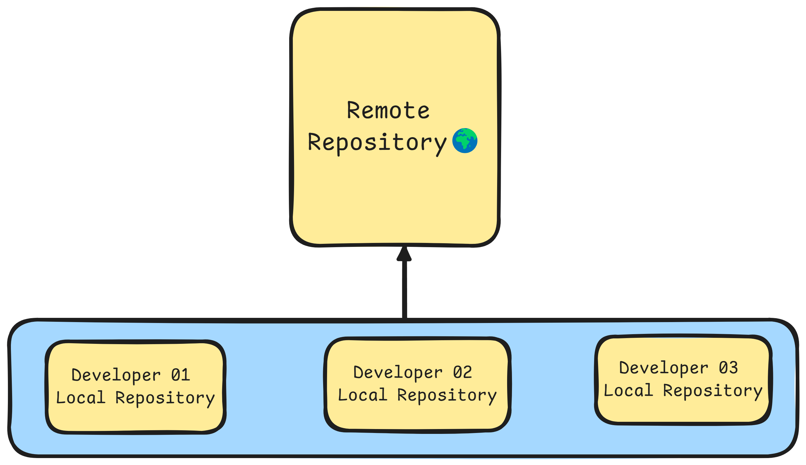

# Introduction to Git

    

## What is Git?
Git is a **distributed version control system** designed to **track changes** in **source code** during software development. It allows multiple **developers to collaborate on a project** keeping a history of changes, facilitating collaboration & ensuring that every modification can be **traced**, **merged** or **reverted** as needed.

## Key Features of Git
- **Content Tracker :** Git **captures snapshots of the entire project directory** & its **contents**. Instead of saving just file changes, Git stores the state of the whole project at the time of each commit efficiently managing versions and history across the project.

    

- **Distributed :** Every developer has a complete **copy of the entire repository** including its history on their own machine.

    

- **Version Control :**  Git tracks changes to files over time allowing us to **go back in time to view**, **manage** & **review the history** of a project. This makes it easy to **restore previous versions** & keep a detailed log of modifications.

    

- **Branching and Merging :** Git allows developers to work on different features or fixes in parallel through **branches** which can later be merged into the main codebase.

    

## Git Repository Types
Git supports two main types of repositories.
1. **Local Repository**
2. **Remote Repository**

    

### 1. Local Repository 
This is a repository stored on our **local machine** where **we can work independently**. Each developer has a complete copy of the project including the **entire version history**. Changes are made **locally** & **can be committed to the local repository** without needing to connect to any **remote server**. In a Local Repository, Git manages changes through **three main areas** :
1. **Working Area**
This is the directory **where we actively make changes to files**. Any **edits**, **additions** or **deletions** happen here but they are **not yet tracked** by **Git** until **we stage them**.
2. **Staging Area (also known as the Index)**
The staging area is a **holding space** between the **working area & the repository**. When we decide to track certain changes **we add them to the staging area** with **`git add`**. It holds a snapshot of what will be included in the next commit.
3. **Commit**
Once changes are staged, we can create a commit using **`git commit`** which **saves the staged changes** to the local repository. Each commit is a snapshot of the project's state at that point in time allowing us to go back in time if needed.

These three areas form the basic workflow in Git ensuring changes are carefully managed before being permanently recorded in the repository.
### 2. Remote Repository
A **remote repository is hosted on a server** & is typically used to **share code among team members** or **backup the project**. Multiple developers can collaborate by pushing their changes to and pulling updates from the remote repository. Popular **remote hosting services** include **GitHub**, **GitLab** & **Bitbucket**.

## Git Add
### What is git add?
**Git add** is a command **used to stage changes in Git** preparing them to be included in the **next commit**. It doesn’t actually commit the changes it simply **moves modified or new files from the working area to the staging area** (also known as the "index"). This step is crucial in Git’s workflow because only staged changes can be committed.
### Key Concepts of git add
1. Staging Changes
2. Staging
3. Tracking New Files
4. Removing Changes from Staging
## Git Commit
### What is Commit?
**Git commit** represents a **snapshot of the project at a specific point in time**. It stores changes made to the files in a repository and forms the backbone of Git's version control.

A commit includes:
- **Author information (name and email)**
- **Commit message (a brief description of the changes)**
- **Changes (diff) (what was added, modified or deleted)**
### Commit Message Guidelines
- **Be clear :** The message should describe the changes and why they were made.
- **Use imperative mood :** Commit messages should describe what the commit does when applied, such as:
    - **`"Fix typo in README"`**
    - **`"Add new authentication method"`**
#### Here are more concise descriptions for different types of Git commits:
- **Added Image :** Included a new image or diagram.
- **Fixed Typo :** Corrected a spelling mistake.
- **Fixed Syntax :** Corrected errors in code or formatting.
- **Added Bold Text :** Highlighted important keywords.
- **Fixed Heading :** Edited or restructured a heading.
- **Updated Image :** Replaced an outdated diagram with a new one.
- **Refined Content :** Improved the clarity or readability of text.
- **Fixed Comments :** Improved explanations in code comments.
## Understanding the Areas in Git
### Working Area
#### Definition
The working area is the local directory where you create and modify files for your project. This area contains all the files and folders that you are currently working on.
#### Characteristics
- **Untracked Changes :** Any new files or changes made to existing files are considered untracked by Git until you explicitly stage them.
- **Local Modifications :** You can freely edit files in this area without affecting the repository history. This is where you do all your development work.
- **Visibility :** Files in the working area can be seen and modified using any text editor or Integrated Development Environment (IDE).

### Staging Area
#### Definition 
The staging area (also known as the index) is an intermediate space where changes are prepared before being committed to the repository. It acts as a buffer between the working area and the committed state.
#### Characteristics
- **Marked for Inclusion :** When you add files to the staging area using the git add command, you mark them for inclusion in the next commit. This allows you to select which changes you want to commit.
- **Snapshot of Changes :** The staging area holds a snapshot of the changes you have staged. This snapshot will be saved in the next commit allowing you to control what gets committed.
- **Selective Committing :** You can stage individual files or specific changes within files, giving you fine-grained control over your commit history.

### Committed Files
#### Definition
Committed files are those that have been saved to the Git repository. A commit is a snapshot of the project at a specific point in time.
#### Characteristics
- **Tracked Changes :** Once files are committed git tracks their changes allowing you to revisit the commit history at any time.
- **Commit History :** Each commit is associated with a unique identifier (hash) and contains metadata, including the author, date & commit message. This history allows you to understand the evolution of your project.
- **Revisions :** Committed files can be reverted, modified or compared with other commits using various Git commands. This feature is crucial for collaboration & maintaining the integrity of the project over time.
