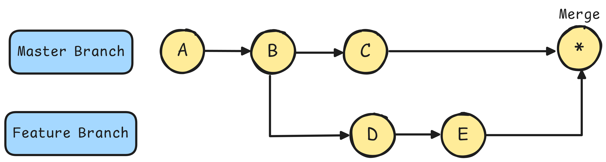

# Introduction to Git

    

## What is Git?
Git is a distributed version control system designed to track changes in source code during software development. It allows multiple developers to collaborate on a project, keeping a history of changes, facilitating collaboration & ensuring that every modification can be traced, merged or reverted as needed.

## Key Features of Git
- **Content Tracker :** Git captures snapshots of the entire project directory and its contents. Instead of saving just file changes, Git stores the state of the whole project at the time of each commit efficiently managing versions and history across the project.

    

- **Distributed :** Every developer has a complete copy of the entire repository including its history on their own machine.

    

- **Version Control :**  Git tracks changes to files over time allowing us to go back in time to view, manage & review the history of a project. This makes it easy to restore previous versions and keep a detailed log of modifications.

    

- **Branching and Merging :** Git allows developers to work on different features or fixes in parallel through branches which can later be merged into the main codebase.

    

## Git Repository Types
Git supports two main types of repositories.
1. **Local Repository**
2. **Remote Repository**

    

### 1. Local Repository 
This is a repository stored on our local machine where we can work independently. Each developer has a complete copy of the project including the entire version history. Changes are made locally & can be committed to the local repository without needing to connect to any remote server. In a Local Repository, Git manages changes through three main areas:
1. **Working Area**
This is the directory where we actively make changes to files. Any edits, additions or deletions happen here but they are not yet tracked by Git until we stage them.
2. **Staging Area (also known as the Index)**
The staging area is a holding space between the working area & the repository. When we decide to track certain changes we add them to the staging area with **`git add`**. It holds a snapshot of what will be included in the next commit.
3. **Commit**
Once changes are staged, we can create a commit using **`git commit`**, which saves the staged changes to the local repository. Each commit is a snapshot of the project's state at that point in time allowing us to go back in time if needed.

These three areas form the basic workflow in Git ensuring changes are carefully managed before being permanently recorded in the repository.
### 2. Remote Repository
A remote repository is hosted on a server and is typically used to share code among team members or backup the project. Multiple developers can collaborate by pushing their changes to and pulling updates from the remote repository. Popular remote hosting services include GitHub, GitLab & Bitbucket.