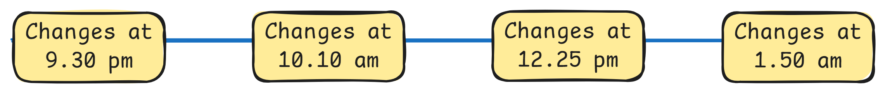
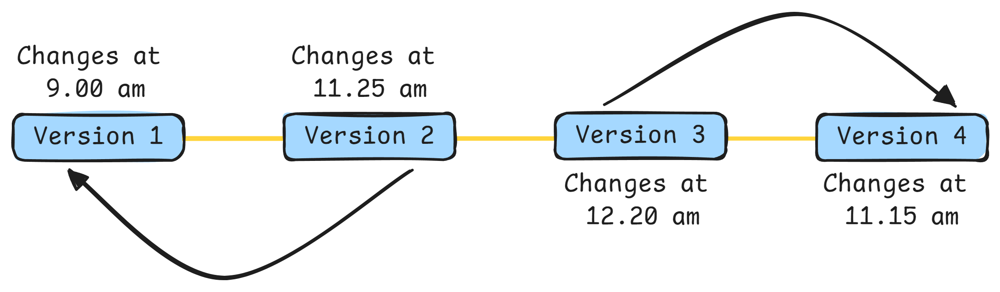

# Introduction to Git

    

## What is Git?
Git is a distributed version control system designed to track changes in source code during software development. It allows multiple developers to collaborate on a project, keeping a history of changes, facilitating collaboration & ensuring that every modification can be traced, merged or reverted as needed.

## Key Features of Git
- **Content Tracker :** Git captures snapshots of the entire project directory and its contents. Instead of saving just file changes, Git stores the state of the whole project at the time of each commit efficiently managing versions and history across the project.

    

- **Distributed :** Every developer has a complete copy of the entire repository including its history on their own machine.

    

- **Version Control :**  Git tracks changes to files over time allowing us to go back in time to view, manage & review the history of a project. This makes it easy to restore previous versions and keep a detailed log of modifications.

    

- **Branching and Merging :** Git allows developers to work on different features or fixes in parallel through branches which can later be merged into the main codebase.

    

