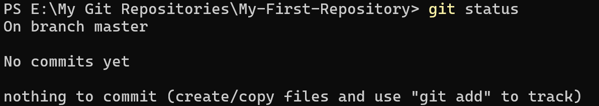
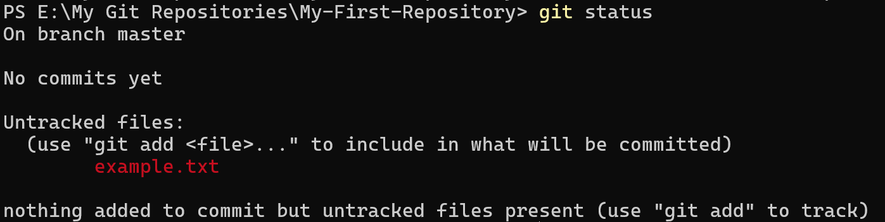
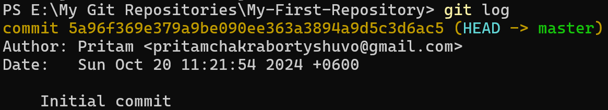

# Process of Initializing a Empty Git Repository from Local to Remote
## Step 1. Create a Directory
Create a empty Directory named "My-First-Repository"
## Step 3. Initialize the Git Repository
Run the following command to initialize a new Git repository
```bash
    git init
```
This command creates a hidden **`.git`** directory in your project folder, which Git uses to track changes.
## Step 2. Check the Status of the Empty Repository
To see the status of this run :
```bash
    git status
```
This will show you which files are untracked, modified or staged. For example
<div align="center">
    
</div>
The message you are seeing indicates that you've initialized a new Git repository but have not yet made any commits. Here’s a breakdown of what this means and the steps to move forward:

**Explanation of the Message**
- **On branch master :** You are currently on the default branch called master (or main in some configurations).
- **No commits yet :** This means you haven’t made any commits to your repository yet.
- **Nothing to commit (create/copy files and use "git add" to track) :** There are no files in the staging area to commit. Git is prompting you to create or copy files into your working directory, stage them & then commit.
## Step 3. Create or Modify Files
You can create a new file in your working area. For example
```bash
    echo "Hello, Git!" > example.txt
```
## Step 4. Check the Status Again
To see the status of your files use
```bash
    git status
```
This will show you which files are untracked, modified or staged.

<div align="center">
    
</div>

## Step 5. Stage the Changes
To add the file to the staging area, use
```bash
    git add example.txt
```
You can also stage all changes in the working area with
```bash
    git add .
```
## Step 5. Check the Status Again
Run **`git status`** to confirm that the file is now staged for commit. It should appear under "**`Changes to be committed.`**"
```bash
    git status
```
<div align="center">
    
</div>

## Step 6. Committing Changes
Once you're ready to save your changes run
```bash
    git commit -m "Initial commit"
```
The **`-m`** flag allows you to add a commit message inline describing the changes made.
## Step 7. Verify the Commit
To confirm that your changes have been committed you can use
```bash
    git log
```
<div align="center">
    
</div>

This will display a log of commits made in the repository including the latest commit.

## Understanding the Areas in Git
### Working Area
#### Definition
The working area is the local directory where you create and modify files for your project. This area contains all the files and folders that you are currently working on.
#### Characteristics
- **Untracked Changes :** Any new files or changes made to existing files are considered untracked by Git until you explicitly stage them.
- **Local Modifications :** You can freely edit files in this area without affecting the repository history. This is where you do all your development work.
- **Visibility :** Files in the working area can be seen and modified using any text editor or Integrated Development Environment (IDE).

### Staging Area
#### Definition 
The staging area (also known as the index) is an intermediate space where changes are prepared before being committed to the repository. It acts as a buffer between the working area and the committed state.
#### Characteristics
- **Marked for Inclusion :** When you add files to the staging area using the git add command, you mark them for inclusion in the next commit. This allows you to select which changes you want to commit.
- **Snapshot of Changes :** The staging area holds a snapshot of the changes you have staged. This snapshot will be saved in the next commit, allowing you to control what gets committed.
- **Selective Committing :** You can stage individual files or specific changes within files, giving you fine-grained control over your commit history.

### Committed Files
#### Definition
Committed files are those that have been saved to the Git repository. A commit is a snapshot of the project at a specific point in time.
#### Characteristics
- **Tracked Changes :** Once files are committed, Git tracks their changes, allowing you to revisit the commit history at any time.
- **Commit History :** Each commit is associated with a unique identifier (hash) and contains metadata, including the author, date, and commit message. This history allows you to understand the evolution of your project.
- **Revisions :** Committed files can be reverted, modified, or compared with other commits using various Git commands. This feature is crucial for collaboration and maintaining the integrity of the project over time.

